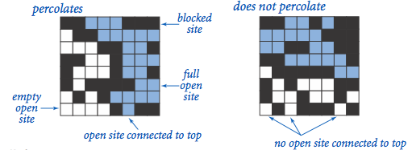
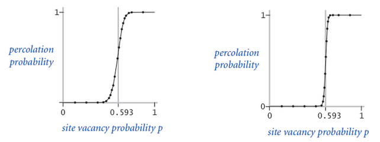

# Project 5: Percolation

This is the directions document for Project 5 Percolation in CompSci 201 at Duke University, Fall 2023.

**See [the details document](docs/details.md) for information** on using Git, starting the project, and more details about the project including information about the classes and concepts that are outlined briefly below. You'll absolutely need to read the information in the [details document](docs/details.md) to understand how the classes in this project work independently and together. The _details_ document also contains project-specific details. This current document provides a high-level overview of the assignment.

## Outline 
- [Project Introduction](#project-introduction)
- [Part 1: `PercolationDFS`](#part-1-percolationdfsfast)
- [Part 2: `PercolationBFS`](#part-2-percolationbfs)
- [Part 3: `PercolationUF`](#part-3-percolationuf)

## Project Introduction

In this assignment, you will write a program to estimate the value of the [percolation threshold](http://en.wikipedia.org/wiki/Percolation_thresholds) via [Monte Carlo](http://en.wikipedia.org/wiki/Monte_Carlo_method) simulation. In doing so, you will better understand depth-first-search, breadth-first-search, union-find structures, and the use of computer simulations for statistical inquiry. _**Your goal will be to explore trade-offs in several approaches to estimate the percolation threshold in an NxN system.**_ 

### Acknowledgements 
This assignment originated at Princeton; thanks to Kevin Wayne from whom staff at Duke first learned of it, and to Jeff Forbes when he was at Duke for ensuring we kept it as part of the assignment-stack at Duke.

### Vocabulary
In a system of rectangular/square NxN grid cells, each cell is sometimes referred to as a _site_ in the assignment and in supporting material, including this background.
- All sites start as **blocked**
- When a site is chosen at random it is **open**
- Open sites connected to the top row are **full**.
- A system in which there's a full cell in the bottom row (and thus a path of full cells from top to bottom) **percolates**.

Given a porous landscape with water on the surface (or oil below), under what conditions will the water be able to drain through to the bottom (or the oil to gush through to the surface)? Given a composite system composed of randomly distributed insulating and metallic materials, what fraction of the materials need to be metallic so that the composite system is an electrical conductor? Scientists have defined an abstract process known as percolation to model such situations.

We model a percolation system using an N-by-N grid of sites. **Each site is either open or blocked. A full site is an open site that can be connected to an open site in the top row via a chain of neighboring (left, right, up, down) open sites.** In diagrams we color full sites blue to model water flowing from the top through the system. We say the **system percolates if there is at least one full site in the bottom row.** In other words, a system percolates if there is a path of open sites from the top row to the bottom row. For the porous substance example, the open sites correspond to empty space through which water might flow, so that a system that percolates lets water fill open sites, flowing from top to bottom.

For more on percolation see the [Princeton Case Study](http://introcs.cs.princeton.edu/java/24percolation/).

## Percolation Threshold

**(Rather than include this in the [the details document](docs/details.md) we include this information here. This project is a simulation).**

The percolation threshold problem is: if sites are independently set to be open with probability p (and therefore blocked with probability (1 − p), what is the probability that the system percolates? In other words, in a N-by-N grid, would the system percolate if N^2 randomly chosen cells are opened?  When p equals 0, the system does not percolate; when p equals 1, the system percolates. The plots below show the site vacancy probability p versus the percolation probability for 20-by-20 random grid (left) and 100-by-100 random grid (right).

When N is sufficiently large, there is a threshold value `p*` such that when `p < p*` a random N-by-N grid almost never percolates, and when `p > p*`, a random N-by-N grid almost always percolates. No mathematical solution for determining the percolation threshold `p*` has yet been derived. Your task is to write a suite of computer programs to visualize the percolation process and estimate `p*` using Monte Carlo techniques. As you can see above, the percolation threshold in an NxN grid is about 0.593. The size of the grid doesn't matter as your simulations will show. 

### Helpful Videos 
The video linked here helps explain the techniques you'll read about. This video may be helpful after reading the assignment, or to get grounded before reading. This video may help situate the classes you write: `PercolationDFS`, `PercolationBFS`, and `PercolationUF`. You should also view [the recording from class on November 8](https://duke.hosted.panopto.com/Panopto/Pages/Viewer.aspx?id=64090dc9-2a30-455c-8bcf-b05f00e03d00) if you weren't there to see the `InteractivePercolationVisualizer` being used.

1. [From DFS to Union-Find: two approaches compared/contrasted](https://youtu.be/a_YMnW4hzmI)

### MazeDemo
The program `MazeDemo.java` within the project you get (`src/MazeDemo.java`) is a model for DFS, BFS, and Union-Find.  You should study the program to reinforce your understanding of these concepts. Two videos of solving a maze using DFS and BFS, respectively, can be found linked below, looking at them and the source code for `MazeDemo.java` may help in understanding how the two searches work. 

- [dfs maze](https://www.youtube.com/watch?v=95igA_fWQtc)
- [bfs maze](https://www.youtube.com/watch?v=dffMgIjfczI)

### Overview: What to Do

Here's a high-level view of the assignment. This is enough information to know what to do, but not necessarily how to do it. For details, you can refer to [the details document](docs/details.md).

You'll create three new implementations of the `IPercolate` interface that you'll test, time, and answer questions about in analyzing tradeoffs. 
1. Create class `PercolationDFS` that extends `PercolationDefault`. Implement one constructor, it simply calls `super` appropriately. You will implement one method, `@Override` the method `search` to use a Stack rather than recursion.
2. Create class `PercolationBFS` that extends `PercolationDefault`. Implement one constructor, it simply calls `super` appropriately. You will implement one method, `@Override` the method `search` to use BFS instead of DFS. 
3. Create class `PercolationUF` that implements the `IPercolate` interface. Implement a constructor and every method from the interface. Instance variables and methods are described in the [the details document](docs/details.md)

For all three classes, test the implementation using the JUnit test class `TestPercolate` by changing which of the three implementations is used. You **must also test using the `InteractivePercolationVisualizer` simulating the percolation using your own click-tests.**  Do not depend only on the JUnit tests.

For the analysis you will run `PercolationStats`. 

## Part 1 `PercolationDFS`
Your new class `PercolationDFSFast` will extend `PercolationDefault` and thus inherit state and methods from that class. That class has protected state, so can be extended.

1. You'll need to create a constructor with an int/size parameter whose only code is a call to `super(..)` to initialize the state in the parent class. 
2. You'll need to `@Override` `search` to use an explicit Stack for DFS rather than recursion.

See [the details document](docs/details.md) for details.

## Part 2: `PercolationBFS`
This class extends the `PercolationDFSDefault` class just as `PercolationBFS` does. 

1. You'll need to create a `PercolationBFS` constructor with an int/size parameter that calls super to initialize the state in the parent class.
2.  You'll need to `@Override` `search` to use a `Queue` just as you used a `Stack` for `PercolationDFS`.

## Part 3: `PercolationUF`
This class `implements` the `IPercolate` interface and will use an `IUnionFind` object to keep track of open and full cells. See the video at the beginning of the assignment for general ideas. You can also look at the `MazeDemo` class in the Percolate assignment to see how union-find can be used. 

See [the details document](docs/details.md) for details.

